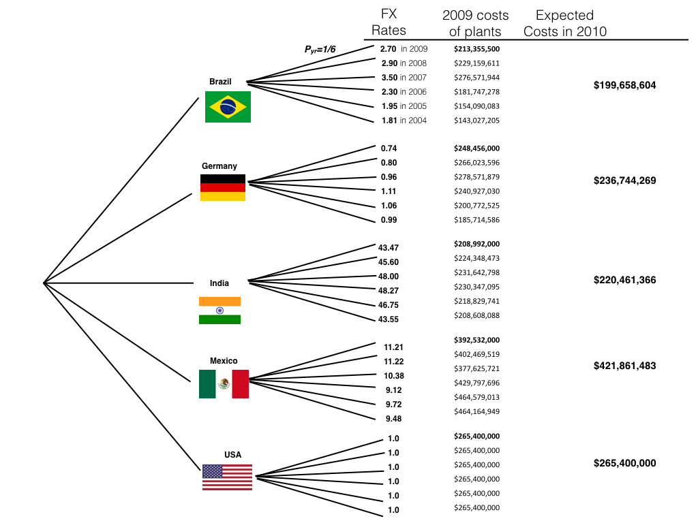

# BS1808 Logistics and Supply Chain Analytics Group Assignment Two
Jone Leung, Somto Okoye, Valentin Poirelle, Jin Anne Lee, Jim Leach, Niccolo Valerio  
27 June 2016  

<br>
<br>
<p style="border:1.5px; border-style:solid; border-color:#000000; padding: 1em;"> This `HTML` report is best viewed using a modern web browser such as Mozilla Firefox or Google Chrome. It is also available on the [online repository](https://github.com/Jim89/lsca_group). Printing is possible but will not produce an optimal reading experience.</p>


```r
# Set default knitr options
knitr::opts_chunk$set(echo = TRUE, message = FALSE, warning = FALSE, fig.align = "center",
                      scipen = 999)

# Load packages
library(dplyr)
library(tidyr)
library(ggplot2)
library(knitr)
```

```
## Warning: package 'knitr' was built under R version 3.2.5
```

```r
library(purrr)
library(readxl)
```

# Introduction

## Project overview

The overarching goal of this project is to optimise inventory and redesign the supply chain network of BioPharma, a chemical company. We took the sales quantities of each region, production costs from each plants and additional market information such as tariffs and forecasts to inform the improved supply network design that is valid for the long term from 2010 onwards. Using a combination of optimisation, decision trees and heuristics, we offer courses of actions for BioPharma to take in order to cut costs and stay competitive in the global market.

In 2009, production wise, all six of BioPharma's plants maintained its capabilities for producing both Highcal and Relax; these chemicals can be shipped to any other parts of the world with additional costs attached. Other relevant information to keep in mind are that not all plants operated at full capacity, i.e. Japan and Germany. The plants in Mexico, US, Brazil and India  operated at full capacity. Mexico and German plants have greater capacities; Germany and Mexico are faced with higher fixed costs; Germany and Japan are faced with higher variable costs. With some markets, some regions such as the US imported Highcal and Germany imported Relax from other plants.

Economically, it is forecasted that revenues are unlikely to increase and will continue to stay stable in the long term. An exception to this is Japan, where sales are expected to grow by compoundingly at 10% annually for the next five years before stablising. More interestingly, the plant in Japan is a technological leader, with the highest yield amongst all plants. All other plants have outdated technology and are in the process of learning from the Japan plant's practices. 

Furthermore, BioPharma faces import duties for all foreign goods entering a country, independent from plant origin. Import tax into Europe, Japan and US is very low. Secondly, by having a Global Network, BioPharma also faces exchange rates risks, which needs to be considered in the design of the new supply network.


# Wiser on Hindsight: What could have been done in 2009? (No closing down)

## The Optimisation Problem

Faced with the above conditions, the following optimisation problem is constructed to identify a more efficient use of resources in 2009

__Decision Variables__

* $Q_{i,j,k}$ is the quantity of chemical $i$ to produce from plant $j$ for region $k$,
* $F_{all,j}$ is the fixed cost independent of chemical produced for plant $j$,
* $F_{i,j}$ is the fixed cost associated to producing chemical $i$ in plant $j$,
* $V_{i,j}$ is the total variable costs (raw materials and production) of producing chemical $i$ in plant $j$,
* $T_{j,k}$ is the transportation costs for shipping from plant $j$ to region $k$, and
* $I_{j,k}$ is the import tax for importing from plant $j$ to region $k$, in decimal form.

where $i=1,2$,   $j=1,2,...,6$,  $k=1,2,...,6$


__Objective Function__

The objective function for cost incurred is as follows:

*minimise* $\sum_{k=1}^6\sum_{j=1}^6 \sum_{i=1}^2 F_{all,j} + F_{i,j} + Q_{i,j,k}.(V_{i,j}+T_{j,k})( 1 +I_{j,k})$


__Constraints__

* Non-negative quantities $Q_{i,j,k}$
* Maximum plant capacity for producing both chemicals
* Meeting sales and demand levels 

## Results

Biopharma should have utilised its resources in the following way:

```r
# Set scipen
options(scipen = 999)

# Get raw demand data
output <- read_excel("optim1.xlsx", sheet = "Sheet1") %>% 
            # Set column names as the first two are not present in the Excel
            set_names(c("region", 
                        "chem", 
                        "brazil", 
                        "germany", 
                        "india", 
                        "japan", 
                        "mex", 
                        "us")) %>%
            # Fill in missing values with the value from the previous row for the 
            # region names which are missing
            mutate(region = zoo::na.locf(region))

# Pretty print the output
kable(output,
      col.names = c("Sale Region", 
                    "Chemical", 
                    "Brazil", 
                    "Germany", 
                    "India", 
                    "Japan", 
                    "Mexico", 
                    "USA"),
      format.args = list(big.mark = ","),
      caption = "Table 1: Optimal Production Output in 2009")
```


Table: Table 1: Optimal Production Output in 2009

Sale Region     Chemical       Brazil      Germany       India       Japan       Mexico          USA
--------------  ---------  ----------  -----------  ----------  ----------  -----------  -----------
Latin America   Highcal     7,000,000            0           0           0            0            0
Latin America   Relax       7,000,000            0           0           0            0            0
Europe          Highcal             0   15,000,000           0           0            0            0
Europe          Relax               0    1,000,000           0           0   11,000,000            0
Asia            Highcal             0            0   5,000,000           0            0            0
Asia            Relax               0            0   3,000,000           0            0            0
Japan           Highcal     4,000,000            0   2,000,000   1,000,000            0            0
Japan           Relax               0            0   8,000,000           0            0            0
Mexico          Highcal             0            0           0           0    3,000,000            0
Mexico          Relax               0            0           0           0    3,000,000            0
US              Highcal             0            0           0           0   13,000,000    5,000,000
US              Relax               0            0           0           0            0   17,000,000

The total cost for this plan is USD 1,329,310,000. Germany and US plants are serving their own regions, as shown by high quantities of Relax in the USA column and Highcal in the Germany column. Brazil, Mexico and India are producing more evenly distributed quantities and serving at least two markets. Japan is producing a very small quantity of Highcal for it's own market.

The Japanese factory should have been idled if given the opportunity because it was only producing 1mil units of Highcal for the local supply. The production of 1million units can be shifted to the plant in India, which is already producing units of Highcal for the Japanese market. This allows BioPharma to save on fixed costs, even though it is not the optimal plan. If the Japanese factory were to be idled, only the general plant fixed costs will be incurred and the cost of this new plan will be USD1,325,340,000.

The results from the optimisation corroborates the serious consideration of shutting down the Japanese plant. In the next section we consider the Japanese's plants strength in production yield and technology.

# Looking ahead: Restructuring the Global Supply Network (closing down plants)

## Optimisation under options
In restructuring its global supply network structure, BioPharma has to consider exchange rate fluctuations and the option of shutting down factories simultaneously. The options available to the network design team are:

1. Keep global network with its current structure and capabilities.
2. Limit the capability of some plants to produce only one chemical, where a plant is limited to producing only one chemical 80% of the fixed costs associated with the chemical no longer produced is saved.
3. Close down some plants, where closing down a plant eliminates all variable costs and saves 80% of annual fixed costs.

Assuming that demand in 2010 is stable and will be the same as in 2009, the cost of the new objective function (for Brazil only) is as follows:

Minimise 

$Cost = (0.8B_0+0.2).F_{all,Brazil}$
$+(0.8B_1+0.2).F_{Brazil,Highcal}+\sum_{k=1}^6 Q_{Highcal,Brazil,k}.(V_{Highcal,Brazil}+T_{Brazil,k}).(1 +I_{Brazil,k})$
$+(0.8B_2+0.2).F_{Brazil,Relax}+\sum_{k=1}^6 Q_{Relax,Brazil,k}.(V_{Relax,Brazil}+T_{Brazil,k}).( 1 +I_{Brazil,k})$

$+...$ costs for five other plants

where

* $B_0$ is the switch for closing or opening the entire Brazil factory
* $B_1$ is the switch for controlling the fixed costs for Highcal 
* $B_2$ is the switch for controlling the fixed costs for Relax 
* $E_0, E_1, E_2, I_0, I_1, I_2$ would similarly be switches for Europe, India, US, Japan, Mexico if the objective function is extended. There are 18 switches in all.

and the additional constraints would be:

* $B_0 \geq B_1$, so that no Highcal is produced when the factory is shut
* $B_0 \geq B_2$, so that no Relax is produced when the factory is shut
* $MB_1 \geq \sum_{k=1}^6 Q_{Highcal,Brazil,k}$, so that no highcal is produced when the facilities are absent.
* $MB_2 \geq \sum_{k=1}^6 Q_{Relax,Brazil,k}$, so that no Relax is produced when the facilities are absent.

where $M$ is a sufficiently large number.

## Results


```r
# Get raw demand data
output2 <- read_excel("optim1.xlsx", sheet = "Sheet2") %>% 
            # Set column names as the first two are not present in the Excel
            set_names(c("region", 
                        "chem", 
                        "brazil", 
                        "germany", 
                        "india", 
                        "japan", 
                        "mex", 
                        "us")) %>%
            # Fill in missing values with the value from the previous row for the 
            # region names which are missing
            mutate(region = zoo::na.locf(region))

# Pretty print the output
kable(output2,
      col.names = c("Sale Region", 
                    "Chemical", 
                    "Brazil", 
                    "Germany", 
                    "India", 
                    "Japan", 
                    "Mexico", 
                    "USA"),
      format.args = list(big.mark = ","),
      caption = "Table 2: Optimal Production Output with new Supply Network Design for 2010")
```


Table: Table 2: Optimal Production Output with new Supply Network Design for 2010

Sale Region     Chemical       Brazil      Germany       India   Japan       Mexico          USA
--------------  ---------  ----------  -----------  ----------  ------  -----------  -----------
Latin America   Highcal     7,000,000            0           0       0            0            0
Latin America   Relax       7,000,000            0           0       0            0            0
Europe          Highcal             0   15,000,000           0       0            0            0
Europe          Relax               0            0           0       0    7,000,000    5,000,000
Asia            Highcal             0            0   5,000,000       0            0            0
Asia            Relax               0            0   3,000,000       0            0            0
Japan           Highcal     4,000,000    1,000,000   2,000,000       0            0            0
Japan           Relax               0            0   8,000,000       0            0            0
Mexico          Highcal             0            0           0       0    3,000,000            0
Mexico          Relax               0            0           0       0    3,000,000            0
US              Highcal             0    1,000,000           0       0   17,000,000            0
US              Relax               0            0           0       0            0   17,000,000

The new optimised cost after completely shutting down the Japanese plant, cutting Relax facilities in Germany, and Highcal facilities in US is: USD 1,293,383,000, USD 35,931,000 less than the cost without closing down plants. This may possibly be attributed to the high fixed costs and low capacity of 10 million units incurred by the Japanese plant. Unless the high costs are justified by the plant being a technological leader or being able to bring other external benefits in the long term to BioPharma the Japanese plant can be shut and the production can be transferred to other plants. As a result, the Japanese market's demand for Highcal will be fulfilled by Brazil, Germany and India and the market demand for Relax by India. From Figure 6-18, it is observed that Japan was already importing chemicals from other plants in 2009 - as its total demand of 15mil units of Highcal and Relax exceeds its capacity of 10mil units. Furthermore, the plant was only producing a meagre 2mil units with full operational costs. 

It is suggested that Germany continue to produce only Highcal in the next year, and an extra million kilograms for Japan and million for US. In addition, the USA will only produce Relax, and export that to Europe whilst replacing US made Relax product with Mexican Relax. Brazil, Mexico, India, and the US will operate at full capacity with minor changes in the quantities of the chemicals. 

## Exchange Rates

The costs of doing business from a plant can be significantly lower due to weakened exchange rates. BioPharma as an international business will be greatly affected by these fluctuations and can opt to redistribute production to different plants based on exchange rates. The following analysis is based on the assumption that BioPharma is a US company and is primarily interested in profits in US dollars as opposed to other currencies.

A decision tree is used to assess the risk of these fluctuations and to calculate the expected return of each plant. Assuming that the exchange rates in 2010 can fall or rise to any of the rates from 2004 to 2009 with equal probability, the following decision tree with expected costs is constructed: 

<<<<<<< Updated upstream

```r
include_graphics("./fxdecisiontree.jpeg")
```

<div class="figure" style="text-align: center">

<p class="caption">Figure 1: Decision Tree</p>
</div>

```r
#
```
=======

```r
include_graphics("./fxdecisiontree.jpeg")
```

<div class="figure" style="text-align: center">

<p class="caption">Figure 1: Exchange Rate Decision Tree</p>
</div>

>>>>>>> Stashed changes

### Analysis

Exchange rates costs are expected to increase significantly at $30mil from Mexico and $12mil from India, and decrease $14mil from Brazil and $12mil from Germany. BioPharma faces a greater problem of rising costs from FX. In response, BioPharma can opt to shift Highcal production to Germany as it is not operating at full capacity. More specifically, Highcal exports to US can be managed by Germany. If necessary and if it becomes more cost effective due to weakening of exchange rates from Europe, Germany could open its Relax production capabilities to serve the European market for Relax. As for Brazil, it exports 1mil kg of Relax to Europe and 3mil kg of Highcal to Japan. Similarly, such productions can be shifted to other plants. 

This situation shows that the German plant's unused capacity may not be as ineffective. The German plant gives BioPharma the flexibility to cope with unexpected economic environments, while maintaining its technological advancements.

Alternatively, these figures for the expected costs for each plant can be reintroduced into the optimisation problem in order to re-estimate the supply chain network. BioPharma can also hedge against exchange rate risks through financial intermediaries.

## How will the increase in demand in the Japanese market be managed by BioPharma?

There is a possibility that at some point in time in the next 5 years that it will be more efficient for BioPharma to serve the Japanese market locally. The 10% compounded increase in sales over the next 5 years translates to approximately to 7.7, 8.5, 9.3, 10.2 and 11.3 million kilograms of Highcal from 2010 to 2014 respectively, and 8.8, 9.7, 10.6, 11.7 and 12.9 million kilograms of Relax from 2010 to 2014. In this network design, we assume that BioPharma will change its supply network for meeting the new demands in 2012 and 2014.

### Results for meeting 2012 chemical demand levels


```r
# Get raw demand data
output5 <- read_excel("optim1.xlsx", sheet = "Sheet5") %>% 
            # Set column names as the first two are not present in the Excel
            set_names(c("region", 
                        "chem", 
                        "brazil", 
                        "germany", 
                        "india", 
                        "japan", 
                        "mex", 
                        "us")) %>%
            # Fill in missing values with the value from the previous row for the 
            # region names which are missing
            mutate(region = zoo::na.locf(region))

# Pretty print the output
kable(output5,
      col.names = c("Region", 
                    "Chemical", 
                    "Brazil", 
                    "Germany", 
                    "India", 
                    "Japan", 
                    "Mexico", 
                    "USA"),
      format.args = list(big.mark = ","),
      caption = "Table 3: Optimal Production Output for 2012 with increase in demand in Japan")
```


Table: Table 3: Optimal Production Output for 2012 with increase in demand in Japan

Region          Chemical       Brazil      Germany       India   Japan       Mexico          USA
--------------  ---------  ----------  -----------  ----------  ------  -----------  -----------
Latin America   Highcal     7,000,000            0           0       0            0            0
Latin America   Relax       7,000,000            0           0       0            0            0
Europe          Highcal             0   15,000,000           0       0            0            0
Europe          Relax               0            0           0       0    7,000,000    5,000,000
Asia            Highcal             0            0   5,000,000       0            0            0
Asia            Relax               0            0   3,000,000       0            0            0
Japan           Highcal     4,000,000    4,200,000     300,000       0            0            0
Japan           Relax               0            0   9,700,000       0            0            0
Mexico          Highcal             0            0           0       0    3,000,000            0
Mexico          Relax               0            0           0       0    3,000,000            0
US              Highcal             0    1,000,000           0       0   17,000,000            0
US              Relax               0            0           0       0            0   17,000,000

For 2012, the costs incurred will be USD 1,336,040,000. We see that the increase in demand of Highcal will be fulfilled by the Germany plant, and the increase in demand of Relax will be fulfilled by the plant in India. This is attributed to lower demand in the plants' local region, allowing it to absorb the additional demand from Japan. Due to high fixed costs and its low capacity, the increase in demand does not make it more efficient for BioPharma to keep its Japanese plant open.

### Results for meeting 2014 chemical demand levels


```r
# Get raw demand data
output6 <- read_excel("optim1.xlsx", sheet = "Sheet6") %>% 
            # Set column names as the first two are not present in the Excel
            set_names(c("region", 
                        "chem", 
                        "brazil", 
                        "germany", 
                        "india", 
                        "japan", 
                        "mex", 
                        "us")) %>%
            # Fill in missing values with the value from the previous row for the 
            # region names which are missing
            mutate(region = zoo::na.locf(region))

# Pretty print the output
kable(output6,
      col.names = c("Region", 
                    "Chemical", 
                    "Brazil", 
                    "Germany", 
                    "India", 
                    "Japan", 
                    "Mexico", 
                    "USA"),
      format.args = list(big.mark = ","),
      caption = "Table 4: Optimal Production Output for 2014 with increase in demand in Japan")
```


Table: Table 4: Optimal Production Output for 2014 with increase in demand in Japan

Region          Chemical       Brazil      Germany        India   Japan       Mexico          USA
--------------  ---------  ----------  -----------  -----------  ------  -----------  -----------
Latin America   Highcal     7,000,000            0            0       0            0            0
Latin America   Relax       7,000,000            0            0       0            0            0
Europe          Highcal             0   15,000,000            0       0            0            0
Europe          Relax               0            0            0       0    7,000,000    5,000,000
Asia            Highcal             0            0    5,000,000       0            0            0
Asia            Relax               0            0    3,000,000       0            0            0
Japan           Highcal     1,100,000   10,200,000            0       0            0            0
Japan           Relax       2,900,000            0   10,000,000       0            0            0
Mexico          Highcal             0            0            0       0    3,000,000            0
Mexico          Relax               0            0            0       0    3,000,000            0
US              Highcal             0    1,000,000            0       0   17,000,000            0
US              Relax               0            0            0       0            0   17,000,000

For 2014, the total costs incurred are USD 1,416,350,000. Similarly to the above, Germany and India will continue to serve the Japanese market in a greater capacity.

## Conclusion

It seems that in the long term, with the current production costs and capacity constraints, it is not effective to keep the Japanese plant open. Unless it is able to decrease running costs or increase capacity, the plant will be shut down, and the local demand will be served by the German and India plants. It is mentioned in the article that "the Japanese plant is a technology leader within the biopharma network in terms of its ability to handle regulatory and environmental issues. " Although it has its advantages in technology, it may be postulated that of its improvements will be learnt and adopted by the other plants, increasing their efficiency and reducing the need for the Japanese plants. In opting to do so, BioPharma will further reduce its exchange rates exposure.

Potentially, the transfer of technological knowledge can be modelled through the following ways:

1. a gradual reduction in variable costs in the production of chemicals over the next 5 years;
2. an increase in yield over the next 5 years;
3. greater production capacity over the next 5 years while fixed costs remains fixed;
4. increase in capabilities of producing two different chemicals, if plants become better at serving the local market;
5. increase in capabilities of specialising in producing one chemical (may be due to environmental laws and economic costs); and
6. greater flexibility and response rate to orders and uncertainty in forecasts such as FX rates and import rates (regulations). 


#Scenario: Expansion Options

## The Optimisation Problem

In considering such options, this changes the optimisation by adding: 

1. Additional binary variables of AB ($\textbf{A}$dditional capacity for $\textbf{B}$razil),  $AG$,  $AI$,  $AJ$,  $AM$ and  $AU$ to function as switches to allocate a mill kg of capacity for one factory:
2. Constraint where additional capacity can only be added to one plant: $AB+AG+AI+AJ+AM+AU
<=1$

## Results


```r
# Get raw demand data
output3 <- read_excel("optim1.xlsx", sheet = "Sheet3") %>% 
            # Set column names as the first two are not present in the Excel
            set_names(c("region", 
                        "chem", 
                        "brazil", 
                        "germany", 
                        "india", 
                        "japan", 
                        "mex", 
                        "us")) %>%
            # Fill in missing values with the value from the previous row for the 
            # region names which are missing
            mutate(region = zoo::na.locf(region))

# Pretty print the output
kable(output3,
      col.names = c("Region", 
                    "Chemical", 
                    "Brazil", 
                    "Germany", 
                    "India", 
                    "Japan", 
                    "Mexico", 
                    "USA"),
      format.args = list(big.mark = ","),
      caption = "Table 5: Optimal Production Output with new Supply Network Design for 2010 with additional capacity")
```


Table: Table 5: Optimal Production Output with new Supply Network Design for 2010 with additional capacity

Region          Chemical       Brazil      Germany       India   Japan       Mexico          USA
--------------  ---------  ----------  -----------  ----------  ------  -----------  -----------
Latin America   Highcal     7,000,000            0           0       0            0            0
Latin America   Relax       7,000,000            0           0       0            0            0
Europe          Highcal             0   15,000,000           0       0            0            0
Europe          Relax               0            0           0       0    7,000,000    5,000,000
Asia            Highcal             0            0   5,000,000       0            0            0
Asia            Relax               0            0   3,000,000       0            0            0
Japan           Highcal     4,000,000            0   3,000,000       0            0            0
Japan           Relax               0            0   8,000,000       0            0            0
Mexico          Highcal             0            0           0       0    3,000,000            0
Mexico          Relax               0            0           0       0    3,000,000            0
US              Highcal             0    1,000,000           0       0   17,000,000            0
US              Relax               0            0           0       0            0   17,000,000

The greatest savings to cost occurs when the plant expanded is India, with a minimum cost of USD 1,293,309,000. Indian production of Highcal increases by the full  1mill kg units which is set to Japan, replacing the 1 mill Highcal units from Germany to Japan. The previous minimum cost with shutting down of plants was USD 1,293,383,000, hence USD 74K savings occurs from this USD 3mill investment. From the financial side the increase in capacity should not be undertaken.

# Scenario: A reduction of duties

## Results

Under the assumption that all import tariffs are removed, the new costs for BioPharma will be at USD 1,267,200,000, which is USD 26,183,000 less than a base scenario with shutting plants (or USD 62,114,000 less than a scenario without shutting plants). This emphasises that import tariffs heavily affects the costs of production and distribution of the chemicals to different regions. 


```r
# Get raw demand data
output4 <- read_excel("optim1.xlsx", sheet = "Sheet4") %>% 
            # Set column names as the first two are not present in the Excel
            set_names(c("region", 
                        "chem", 
                        "brazil", 
                        "germany", 
                        "india", 
                        "japan", 
                        "mex", 
                        "us")) %>%
            # Fill in missing values with the value from the previous row for the 
            # region names which are missing
            mutate(region = zoo::na.locf(region))

# Pretty print the output
kable(output4,
      col.names = c("Region", 
                    "Chemical", 
                    "Brazil", 
                    "Germany", 
                    "India", 
                    "Japan", 
                    "Mexico", 
                    "USA"),
      format.args = list(big.mark = ","),
      caption = "Table 6: Optimal Production Output for 2010 without import tariffs")
```


Table: Table 6: Optimal Production Output for 2010 without import tariffs

Region          Chemical       Brazil      Germany       India   Japan       Mexico          USA
--------------  ---------  ----------  -----------  ----------  ------  -----------  -----------
Latin America   Highcal     7,000,000            0           0       0            0            0
Latin America   Relax       7,000,000            0           0       0            0            0
Europe          Highcal             0   13,000,000           0       0    2,000,000            0
Europe          Relax               0            0   7,000,000       0            0    5,000,000
Asia            Highcal     1,000,000    4,000,000           0       0            0            0
Asia            Relax               0            0   3,000,000       0            0            0
Japan           Highcal             0            0           0       0    7,000,000            0
Japan           Relax               0            0   8,000,000       0            0            0
Mexico          Highcal     3,000,000            0           0       0    3,000,000            0
Mexico          Relax               0            0           0       0            0            0
US              Highcal             0            0           0       0   18,000,000            0
US              Relax               0            0           0       0            0   17,000,000

Without import tariffs, optimal production quantity will depend more heavily on actual costs of production and transportation. Brazil, India, Mexico, and the USA work at full capacity, as they are cheapest to produce in. Further, whilst we see Germany and the US continuing to stick to production of goods in which they have a comparative advantage in  (Germany Highcal, USA Relax); nearly all other plants - with the exception of Brazil - start to specialise in producing one chemical only, and each plant producing for a region outside of its own (i.e. trade). From an Economist's point of view this lowering of tariffs represents a lessening of red tape, and the model of the economy is tending towards an equilibrium where countries specalise in producing goods in which they have a comparative advantage in (Riccardo), i.e. India and USA in Relax, Mexico and Germny in Highcal. From a more objective point of view, the lowering of tariffs has resulted in more plants being allowed to close down, resulting in more savings of fixed costs.

# Accounting for yield differences across plants

Yield (Throughput Yield in this case) is defined as manufacturing output per unit raw material input over a particular time period. A 100% yield would mean a fully efficient manufacturing process. A reduction in yield, say to 90%, would mean that more materials would be required in order to maintain the same output as with 100% yield, hence the raw material and production costs for each chemical at each plant would be divided by 0.9. Another method of modelling this is to think the change in capacity for useful production. Since product is wasted, we can no longer assume that the production capacity at each plant is the same, the fall in yield also materialises as a reduction in production capacity by multiplying each plant’s capacity by 0.9. Therefore, the parameters of capacity and yield can be added into the optimisation above for each plant. Additionally, in a more complex situation, an interaction of the term the capacity and yield can be added to capture this phenomenon. If BioPharma were to take a step further, they may consider investing in resources to determine these parameters to inform their new supply network.

As an example, (in applying stereotypes), the German plant may have a yield of 95% as compared to the 80% in the US plant. The addition of differences in yield will affect our analysis in each plants productivity. This reduction in yield may affect Germany's and India's ability to export Highcal and Relax respectively to Japan. 


# Other factors to be considered in our recommendations
When making the recommendations on production, a number of other factors might also need to be accounted for as they all have some effect on production capacity and demand:

Sales projections: Similar to the projected 10% increase in demand from Asia W/O Japan in the case, the company’s sales team might have uncovered other markets (the rest of the BRIC’s for example), industries, or initiatives by current clients which could signal an increase in demand, and this should normally be taken into account to avoid potential undersupply due to underproduction. It can also indicate potential reduction in demand.

Competition: Increased competition (new entrants or alternative products) could reduce demand and therefore should be accounted for in forecasts. Likewise, the demise of a competitor especially when due to singular reasons, could sign a potential increase in demand from its previous clients.

Relative Inflation/Exchange rates: Inflation could have an effect on where to manufacture and supply to. All else being equal, countries which have a higher level of inflation would ideally be better manufacturing bases as their depreciating currency value would result in their exports becoming cheaper. It would also mean imports would become costlier for them, and would make it preferable to source goods locally and manufacture locally. Likewise, countries with relatively low interest rates would be more beneficial purchasers as they would prefer lower prices from the cheaper countries, possess a more stable currency and be able to pay more for the same goods.

Political turmoil/Natural Disasters: Unprecedented disasters in different countries/locations could adversely affect supply chains, resulting on consequences across the chain. Weather events such as tornadoes and tsunamis could drastically reduce production capacity, while political turmoil could also result in sanctions, civil wars, and reduce demand in the same way. Biopharma should therefore consider this, either through sourcing from multiple suppliers and/or slowly reducing dependency on potentially unstable countries.

Oil prices: Oil prices are a major component of supply chain costs. Being the major factor in virtually all means of transportation, changing oil prices would have an effect on freight transportation costs for Biopharma and their suppliers, and a possible subsequent effect on demand from oil producing countries.

