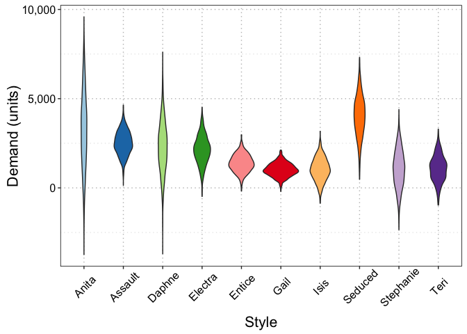
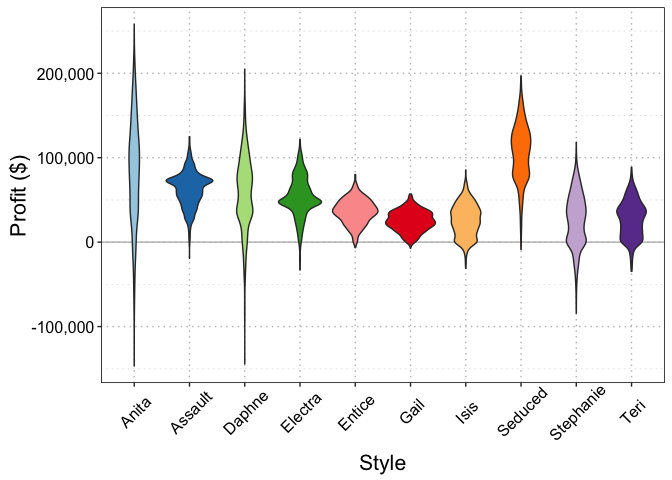

# BS1808 Logistics and Supply Chain Analytics Group Assignment One
Jone Leung, Somto Okoye, Valentin Poirelle, Jin Anne Lee, Jim Leach  
`r Sys.Date()`  

<br>
<br>
<p style="border:1.5px; border-style:solid; border-color:#000000; padding: 1em;">The Excel sheets used to perform this analysis has been attached to the submission of this report. This `HTML` report is best viewed using a modern web browser such as Mozilla Firefox or Google Chrome. It is also available on the [online repository](https://github.com/Jim89/lsca_group). Printing is possible but will not produce an optimal reading experience.</p>

# Introduction

## Project overview

In this project we have analysed data from _Sport Obermeyer_, a global skiwear company. We have used forecasts of demand for a range of Obermeyer's products in order to determine how many of each style to order. We have considered ordering policies based on ordering from both Hong Kong and China, and have developed a measure of risk in each case. Finally, we have considered operational changes that Obermeyer may wish to consider making, and made proposals for their short and long term sourcing strategies.  


```r
# Set default knitr options
knitr::opts_chunk$set(echo = FALSE, message = FALSE, warning = FALSE, fig.align = "center")

# Load packages
library(dplyr)
library(tidyr)
library(ggplot2)
library(knitr)
```

```
## Warning: package 'knitr' was built under R version 3.2.5
```

```r
library(purrr)
library(readxl)

# Set up theme object for prettier plots
theme_jim <-  theme(legend.position = "none",
    axis.text.y = element_text(size = 12, colour = "black"),
    axis.text.x = element_text(size = 12, colour = "black"),
    legend.text = element_text(size = 12),
    legend.title = element_text(size = 16),
    title = element_text(size = 16),
    strip.text = element_text(size = 12, colour = "black"),
    strip.background = element_rect(fill = "white"),
    panel.grid.minor.x = element_blank(),
    panel.grid.major.x = element_line(colour = "grey", linetype = "dotted"),
    panel.grid.minor.y = element_line(colour = "lightgrey", linetype = "dotted"),
    panel.grid.major.y = element_line(colour = "grey", linetype = "dotted"),
    panel.margin.y = unit(0.1, units = "in"),
    panel.background = element_rect(fill = "white", colour = "lightgrey"),
    panel.border = element_rect(colour = "black", fill = NA))

# Function that takes a string and converts it in to "proper case" (i.e.
# the first letter is capitalised, all remaining letters are lower case)
# N.b. for multi-word strings, only the first word will be affected
toproper <- function(x) { 
  first <- substring(x, 1, 1) %>% toupper()
  rest <- substring(x, 2) %>% tolower()
  whole <- paste0(first, rest)
  return(whole)
}
```

# Simulating demand

Each of the 10 styles of Parka under consideration for production had had demand forecasts made for them by members of the Obermeyer team. For each style, Obermeyer assumed that the _true_ demand value could be modelled as a random number from the [normal distribution](https://en.wikipedia.org/wiki/Normal_distribution) with a mean given by the average of the individuals' forecasts, and a stardard deviation equal to _twice_ the standard deviation of all individuals' forecasts. The individual forecasts, and the resulting mean and standard deviation values for the true demand distributions, are displayed in table one. 


Table: Table One: Demand forecasts for each style

Style        Laura   Carolyn    Greg   Wendy     Tom   Wally    Mean      SD   SD x2
----------  ------  --------  ------  ------  ------  ------  ------  ------  ------
Anita        4,400     3,300   3,500   1,500   4,200   2,875   3,296   1,047   2,094
Assault      2,500     1,900   2,700   2,450   2,800   2,800   2,525     340     680
Daphne       1,700     3,500   2,600   2,600   2,300   1,600   2,383     697   1,394
Electra      2,500     1,900   1,900   2,800   1,800   2,000   2,150     404     807
Entice       1,200     1,600   1,500   1,550     950   1,350   1,358     248     496
Gail           900     1,000     900   1,300     800   1,200   1,017     194     388
Isis           800       700   1,000   1,600     950   1,200   1,042     323     646
Seduced      4,600     4,300   3,900   4,000   4,300   3,000   4,017     556   1,113
Stephanie      600       900   1,000   1,100     950   2,125   1,113     524   1,048
Teri           800       900   1,000   1,100     950   1,850   1,100     381     762

Using these values we generated 1000 estimates of demand for each style from a normal distribution with a mean and standard deviation as described above. The distributions of these 1000 estimates for each parka are displayed in figure one.

<div class="figure" style="text-align: center">

<p class="caption">Figure 1: Demand estimate distribution for each parka style.</p>
</div>

We then used these demand data in a Monte-Carlo analysis to decide on how much of each style to order.


# Ordering with no minimum

Initially, we considered a situation in which there were no minimum order requirements. That is, Obermeyer could order any amount of each style that they wished. However, from the 10 styles they had to order at least 10,000 in aggregate. We ignored price and production cost differences across the styles. 

In order to do so, we defined a formula that provided an expectation of the profit for a given quantity of each style:

\begin{equation}
\mbox{Profit} (\Pi_q) = \sum_{j=1}^{10}\bigg[ \frac{1}{n} \sum_{i=1}^n \Big[p.d_{ij} + s    .\max(Q_j - d_{ij}, 0) - c.\max(Q_j, d_{ij})\Big] \bigg]
\end{equation}

Where:

* $Q_j$ is the quantity of style $j$ to produce;
* $p$ is the sale price;
* $s$ is the outlet/markdown price;
* $c$ is the cost of production; and 
* $d_{ij}$ is the $i$^th^ demand value for style $j$.

We note that this is not the standard formula for profit when determining optimal order quantity. This is because Obermeyer only have to produce 10,000 units now and can produce the rest later. Therefore sales revenue is a function of the actual demand realised and not dependent on the current order quantity. However, the (final) cost of production may change (in the future) if more/less of each style is produced now relative the the actual demand realised. Hence the first and third terms in the inner summation differ slightly from the standard formula.

Having defined this function, we then used the `Excel` solver to find the optimum order quantity for each style, $Q_j^*$ via the following optimsation program:

\begin{equation} 
\begin{split}
\max_{Q} \mathbb{E} (\Pi_q) \\
\text{s.t.} \\
\sum_{j=1}^{10} Q_j \geq 10000 \\
Q_j \geq 0
\end{split}
\end{equation}

## No minimum order results

The resulting solution from the `Excel` solver, including both order quantity and expected profit for each style is displayed in table 2. 


Table: Table 2: Order quanties and expected profits for each style with no minimum order requirements

Style        Order Quantity   Expected Profit ($)
----------  ---------------  --------------------
Gail                    655             26,625.53
Isis                    488             28,677.68
Entice                  896             38,120.13
Assault               1,750             68,599.96
Teri                    465             32,443.59
Electra               1,277             53,707.22
Stephanie               121             31,216.71
Seduced               2,606            111,866.21
Anita                   616             79,478.24
Daphne                1,126             68,966.20

Under this scheme, total profit was expected to be $539,701, ordering a total of 10,000 units.

# Order from Hong Kong

In order to refine the problem we then considered the situation in which there _were_ minimum order requirements. When ordering from Hong Kong there was a minimum order requirement of 600 units. This substantially changed the profit function and resulting optimisation problem.

## Define scenarios

When considering total profit from the order quantity, four scenarious had to be considered:

1. The true demand realisation was _less_ than the initial order quantity, $Q_j$;
2. The true demand realisation was greater than the initial order quantity but below a threshold (based on the mimimum order requirement) that would trigger making a second order for that style at a later date;
3. The true demand realisation was greater than the initial order quantity plus the threshold value that would trigger making a second order for that style at a later date; and
4. The true demand realisation was greater than the initial order quantity plus the minimum order quantity.

## Define scenario profit outcomes

In each of the four scenarious, the profit formula would change slightly:

1. In the first scenario, Obermeyer would sell only the true demand realised, there would be an overstocking cost (based on the difference between the order quantity and the true demand), and the production cost would be dependent only on the initial order quantity;
2. In the second scenario, Obermeyer would sell the intial order quantity, there would be no overstocking cost and the production cost would be dependent only on the initial order quantity;
3. In the third scenario, Obermeyer would see the true demand realised, there would be an overstocking cost (based on the difference in the initial order quantity plus the minimum order quantity less the true demand), and the production cost would be dependent on the intial order quantity plus the minimum order quantity; and
4. In the fourth scenario, Obermeyer would sell the true demand realised, there would be no overstocking cost, and the production cost would be dependent only on the true demand realisation.

## Define scenario profit functions

In order to implement these four scenarious in the overall profit calculation, we defined four separate profit functions, one for each scenario (labelled $P_1$ to $P_4$):

\begin{equation} 
P_1 = p.d_{ij} + s.\max(Q_j - d_{ij}, 0) - c.Q_j
\end{equation}

\begin{equation}
P_2 = p.Q_j - c.Q_j
\end{equation}

\begin{equation}
P_3 = p.d_{ij} + s.\max(Q_j + q_{min} - d_{ij}, 0) - c.(Q_j + q_{min})
\end{equation}

\begin{equation}
P_4 = p.d_{ij} - c. d_{ij}
\end{equation}

Where $q_{min}$ is the minimum order quantity.

## Define scenario indicator functions

We then implemented four _indicator_ functions ($I_1$ to $I_4$) that could be used in the overall profit function to "switch" the four individual profit functions on/off depending on the comparison between the order quantity and the realised demand:

\begin{equation} 
I_1 = \dfrac{\max(Q_j - d_{ij}, 0)}{Q_j - d_{ij}}
\end{equation}

\begin{equation} 
I_2 = \dfrac{\max((Q_j + \frac{q_{min}(c-s)}{(p-s)}) - d_{ij}, 0)}{(Q_j + \frac{q_{min}(c-s)}{(p-s)}) - d_{ij}}
\end{equation}

\begin{equation} 
I_3 = \dfrac{\max((Q_j + q_{min}) - d_{ij}, 0)}{(Q_j - q_{min}) - d_{ij}}
\end{equation}

\begin{equation} 
I_4 = 1 - I_3
\end{equation}

In these equations $\frac{q_{min}(c-s)}{(p-s)}$ defines the threshold at which a new order will be placed if the realised demand exceeds the initial quantity ordered.

## Define overall profit function

Using the individual profit functions in conjunction with the indicator functions, we were then able to define an _overall_ profit function for this scenario:

\begin{equation}
Profit (\pi_q) = \sum_{j=1}^{10}\bigg[\frac{1}{n} \sum_{i=1}^{n} \Big[I_1.P_1 + (I_2 - I_1).P_2 + (I_3 - I_2).P_3 + I_4.P_4\Big]\bigg]
\end{equation}

We then translated this into a new optimsation problem that incorporated the minimum order requirements of producing in Hong Kong:

\begin{equation} \begin{split}
\max_{Q_j, z_j} \mathbb{E} (\pi_q) \\
\text{s.t.} \\
\sum_{j=1}^{10} Q_j \geq 10000 \\
Q_j \geq 0 \\
Q_j \geq q_{min}.z_j \\
Q_j \leq M.z_j \\
z_j \in \{0, 1\}
\end{split}
\end{equation}

Where $z_j$ is a binary variable indicating if style $j$ will be produced (which enables the minimum order quantites to be modelled).

## Hong Kong order results

The resulting solution from the `Excel` solver, including both order quantity and expected profit for each style is displayed in table 3. 


Table: Table 3: Order quanties and expected profits for each style with Hong Kong minimum order requirements (600 units)

Style        Order Quantity   Expected Profit ($)
----------  ---------------  --------------------
Gail                      0                26,744
Isis                    600                27,664
Entice                  877                37,377
Assault               1,745                68,157
Teri                    600                31,776
Electra               1,151                53,476
Stephanie                 0                31,122
Seduced               2,896               111,352
Anita                   906                78,906
Daphne                1,225                68,591

Under this scheme, total profit was expected to be $535,167, ordering a total of 10,000 units.

## Ordering policy risk

Having determined the optimal order quantities for each style, we then quantified the risk associated with this ordering policy. We decided that the main risk was from overstocking - ordering an initial quantity higher than the true realisation of demand (as this would incur write downs and wasted production costs). Understocking on the initial order was less of a risk, as more could be produced later in the second order.

We therefore calculated, for each style's initial order quantity, the proportion of overstocking events based on the demand distributions generated from Obermeyer's forecasts. These proportions are displayed in table 4.


Table: Table 4: Overstocking likelihood for each style when ordering from Hong Kong.

Style        Order Quantity   Overstock Likelihood (%)
----------  ---------------  -------------------------
Anita                   906                         14
Assault                1745                         13
Daphne                 1225                         22
Electra                1151                         11
Entice                  877                         15
Gail                      0                          0
Isis                    600                         24
Seduced                2896                         17
Stephanie                 0                          0
Teri                    600                         26

The overall (average) risk of overstocking was calculated to be 15.9%. 

In order to quantity this more concretely, we also assessed the distribution of profit values calculated based on the order quantities determined by the optimisation, and the realisation of demand in the simulations (as negative impacts on profit will be primarily be caused by overstocking on the intial order). The standard deviation of profit for each style is displayed in table 5, and figure 2 shows the overall distribution of profit for each style.


Table: Table 5: Mean and standard deviation of profit expectation per style

Style        Profit ($)   Standard Deviation
----------  -----------  -------------------
Anita          78906.50             59967.48
Assault        68157.02             19081.23
Daphne         68591.43             41926.13
Electra        53476.47             22600.75
Entice         37377.02             14232.68
Gail           26744.37             10385.08
Isis           27663.72             18757.01
Seduced       111352.31             32652.17
Stephanie      31121.50             30049.65
Teri           31776.21             21561.59

<div class="figure" style="text-align: center">

<p class="caption">Figure 2: Profit estimates for each parka style based on determined order quantites in Hong Kong.</p>
</div>

<br>

__The overall profit is $535,167 with a standard deviation of 27,990.09 due to a 15.9% risk of overstocking.__

# Order from China

We also considered the same problem, but this time assumed that all styles were ordered from China, where the minimum order quantity was 1200 units. The same four scenarios defined for Hong Kong were also relevant to the analysis for ordering from China. As such, the overall optimisation problem remained the same for China as for Hong Kong, only with a different $q_{min}$ value of 1200.

## China order results

The resulting solution from the `Excel` solver, including both order quantity and expected profit for each style is displayed in table 6. 


Table: Table 6: Order quanties and expected profits for each style with Chinese minimum order requirements (1200 units)

Style        Order Quantity   Expected Profit ($)
----------  ---------------  --------------------
Gail                      0                24,647
Isis                      0                26,758
Entice                    0                37,559
Assault               2,712                63,884
Teri                      0                31,266
Electra               1,746                50,545
Stephanie                 0                30,001
Seduced               2,883               110,641
Anita                 1,370                77,494
Daphne                1,288                67,426

Under this scheme, total profit was expected to be $520,222, ordering a total of 10,000 units.

## Ordering policy risk

We then quantified the risk associated with this ordering policy in the same was as for Hong Kong. The proportion of overstocking events based on the demand distributions generated from Obermeyer's forecasts are displayed in table 7.


Table: Table 7: Overstocking likelihood for each style when ordering from China.

Style        Order Quantity   Overstock Likelihood (%)
----------  ---------------  -------------------------
Anita                  1370                         20
Assault                2712                         61
Daphne                 1288                         24
Electra                1746                         30
Entice                    0                          0
Gail                      0                          0
Isis                      0                          0
Seduced                2883                         16
Stephanie                 0                          0
Teri                      0                          0

The overall (average) risk of overstocking was calculated to be 18%, slightly higher than for Hong-Kong. 

Similarly, we also assessed the distribution of profit values calculated for China based on the order quantities determined by the optimisation, and the realisation of demand in the simulations. The standard deviation of profit for each style is displayed in table 8, and figure 3 shows the overall distribution of profit for each style.


Table: Table 8: Mean and standard deviation of profit expectation per style

Style        Profit ($)   Standard Deviation
----------  -----------  -------------------
Anita         77,494.36            61,336.19
Assault       63,884.22            20,208.82
Daphne        67,426.15            42,384.35
Electra       50,544.81            23,551.19
Entice        37,558.72            14,546.23
Gail          24,646.60            12,034.36
Isis          26,758.43            18,988.63
Seduced      110,641.19            33,130.86
Stephanie     30,001.15            30,610.15
Teri          31,266.02            21,610.36

<div class="figure" style="text-align: center">

<p class="caption">Figure 3: Profit estimates for each parka style based on determined order quantites in China.</p>
</div>

<br>

__The overall profit is $520,222 with a standard deviation of 27,844.43 due to a 18% risk of overstocking. The average profit is lower than for Hong Kong, but the standard deviation is marginally smaller.__

# Operational changes recommendations
Question: What operational changes would you recommend to Wally to improve performance? Clearly list the expected benefits from each change. Please try and be very specific in terms of the changes and benefits in response to this question.

__Recommended changes list__

1. Tailored Postponement
2. 

## Tailored Postponement

With Wally leaning towards quantitative methods, it is assumed that he is looking to improve performance in order to increase expected profits. One available method for increasing expected profits from forecasting is to reduce demand uncertainty. This can be achieved through tailored postponement. An option is to evelop a procedure where styles can be made from a standard base product that can be ordered in bulk and then customised based when demand is certain. This allows for the aggregation of demand across styles that have higher variability. We assume that aggregation will reduce variance, but increase production costs as well due to customisation later in the production time and increase production time. 

-look for evidence in the text that the styles are similar to customise.

Generally, as uncertainty decreases, it becomes easier to match inventory to demand, and so expected profit increases. Expected understock and expected overstock will reduce. In this case, the cost of understocking is zero, and the cost of overstocking is high. So it would be better if we understock than overstock. So we want a lower inventory. In our case, when demand is highly uncertain, the optimal quantity will be below the mean. If we reduce the uncertainty, optimal quantity will increase and approach the mean.

For both HK and CN, we can consider the following options for aggregating demand. 
1. aggregate high variability without considering quantity demanded
2. aggregate low demand quantity without considering variance
3. aggregate in a combination of variability + quantity demanded

The products with the highest standard deviation are: Anita - 2094, Daphne - 1394, Seduced - 1113 and Stephanie - 1048.

### Consider the Ordering Policy from HK

There are four styles with quantity demanded estimated to be below 600 for maximum profits: Stephanie, Anita, Teri, Isis and Gail. The styles with zero orders are Gail and Stephanie, and styles with 600 orders are Isis and Stephanie. The styles that contribute most to the likelihood of overstocking in order are Teri, Isis and Daphne. As the minimum requirement is 10,000, with some optimal order quantity at zero, this contributes to the likelihood of overstocking on other styles.

Solutions are: group the products with highest standard deviation together, which are Anita, Daphne, Seduced and Stephane. To reduce likelihood of overstocking, styles of Teri, Isis and Daphne can be grouped together. To aim to produce all styles, Stephanie, Gail, Isis and Teri can be grouped together. All these solutions will reduce demand uncertainty and hence increase expected profits to an extent. 

### Consider the Ordering Policy from CN

Products with zero order quantity are: Gail, Isis, Entice, Teri and Stephanie. Styles with estimated demand being less than 1000 are Gail, Isis, Stephanie and Teri. Hence, grouping the five styles together will reduce demand uncertainty altogether. 

### Benefits of reducing uncertainty includes
1. For the sample, the cost of overstocking will be reduces, leading to an increase in expected profits.
2. Retailers can see the style samples and make more accurate orders.
3. 

When is the buying decision made? After buying decision is made, they can produce the remaining stocks. Looking at the way the style is produced and how it will affect the production process. E.g. at the factory, is everything done?


# Sourcing options
How should Obermeyer management think (both short term and long term) about sourcing in Hong Kong versus China? What sourcing policy would you recommend?

Short Term
Company's products
- quality is better in HK
- more experience and better SC relations in HK
- Obermeyer competed by offering an excellent price/value relationship, where value was defined as both functionality and style, and targeted the middle to high end of the skiwear market.Functionality was critical to the serious skier—products had to be warm and water-proof, yet not constrain the skier's ability to move his or her arms and legs freely.
Company's Supply Chain & Supply China Relations
- less risk when producing in HK, more likely to meet deadlines due to shorter production lines
- better worker conditions in HK
Company's profits
Company's reputation
Company's growth & efficiency

The allocation of operations to workers differed from one factory to another depending on the workers' level of skill and the degree of worker cross-training. Workers in Hong Kong worked about 50% faster than their Chinese counterparts. In addition to being more highly skilled, Hong Kong workers were typically trained in a broader range of tasks. Thus, a parka line in Hong Kong that required 10 workers to complete all operations might require 40 workers in China. Longer production lines in China led to greater imbalance in these lines; hence, a Hong Kong sewer's actual output during a given period of time was nearly twice that of a Chinese worker.

Option: 
Produce first batch in China, then place second order from HK.
Produce customised batch when placing the second order. 
Produce sample in HK with smaller minimum size, then produce large batches in China

Long Term
- more profits to be made in China
- however, quality may not be there
- US restrictions on import quantity 
- in the long term China may not be able to manage production and inventory risks as well as HK.
-  Would China's larger minimum order sizes limit the company's ability to increase the range of products it offered or to manage inventory risk? Was Obermeyer's trend toward increased production in China too risky given the uncertainty in China's trade relationship with the United States?
- The U.S. government limited the number of units that could be imported from China into the United States. Government officials at the U.S. port of entry reviewed imports; products violating quota restrictions were sent back to the country of origin. Since quota restrictions were imposed on the total amount of a product category all companies imported from China, individual companies often rushed to get their products into the country before other firms had "used up" the available quota.

